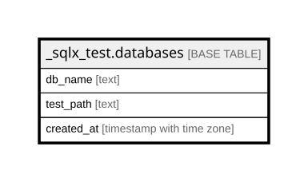

# _sqlx_test.databases

## Description

## Columns

| Name | Type | Default | Nullable | Children | Parents | Comment |
| ---- | ---- | ------- | -------- | -------- | ------- | ------- |
| db_name | text |  | false |  |  |  |
| test_path | text |  | false |  |  |  |
| created_at | timestamp with time zone | now() | false |  |  |  |

## Constraints

| Name | Type | Definition |
| ---- | ---- | ---------- |
| databases_created_at_not_null | n | NOT NULL created_at |
| databases_db_name_not_null | n | NOT NULL db_name |
| databases_test_path_not_null | n | NOT NULL test_path |
| databases_pkey | PRIMARY KEY | PRIMARY KEY (db_name) |

## Indexes

| Name | Definition |
| ---- | ---------- |
| databases_pkey | CREATE UNIQUE INDEX databases_pkey ON _sqlx_test.databases USING btree (db_name) |
| databases_created_at | CREATE INDEX databases_created_at ON _sqlx_test.databases USING btree (created_at) |

## Relations

---

> Generated by [tbls](https://github.com/k1LoW/tbls)
