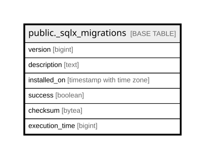

# public._sqlx_migrations

## Columns

| Name | Type | Default | Nullable | Children | Parents | Comment |
| ---- | ---- | ------- | -------- | -------- | ------- | ------- |
| version | bigint |  | false |  |  |  |
| description | text |  | false |  |  |  |
| installed_on | timestamp with time zone | now() | false |  |  |  |
| success | boolean |  | false |  |  |  |
| checksum | bytea |  | false |  |  |  |
| execution_time | bigint |  | false |  |  |  |

## Constraints

| Name | Type | Definition |
| ---- | ---- | ---------- |
| _sqlx_migrations_checksum_not_null | n | NOT NULL checksum |
| _sqlx_migrations_description_not_null | n | NOT NULL description |
| _sqlx_migrations_execution_time_not_null | n | NOT NULL execution_time |
| _sqlx_migrations_installed_on_not_null | n | NOT NULL installed_on |
| _sqlx_migrations_success_not_null | n | NOT NULL success |
| _sqlx_migrations_version_not_null | n | NOT NULL version |
| _sqlx_migrations_pkey | PRIMARY KEY | PRIMARY KEY (version) |

## Indexes

| Name | Definition |
| ---- | ---------- |
| _sqlx_migrations_pkey | CREATE UNIQUE INDEX _sqlx_migrations_pkey ON public._sqlx_migrations USING btree (version) |

## Relations

---

> Generated by [tbls](https://github.com/k1LoW/tbls)
