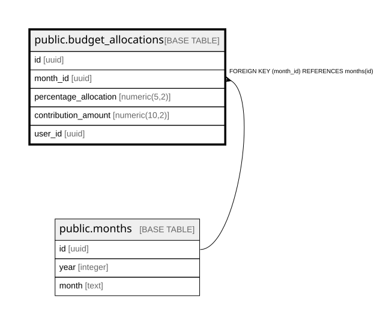

# public.budget_allocations

## Description

## Columns

| Name | Type | Default | Nullable | Children | Parents | Comment |
| ---- | ---- | ------- | -------- | -------- | ------- | ------- |
| id | uuid |  | false |  |  |  |
| month_id | uuid |  | false |  | [public.months](public.months.md) |  |
| percentage_allocation | numeric(5,2) |  | false |  |  |  |
| contribution_amount | numeric(10,2) |  | false |  |  |  |
| user_id | uuid |  | false |  |  |  |

## Constraints

| Name | Type | Definition |
| ---- | ---- | ---------- |
| budget_allocations_contribution_amount_not_null | n | NOT NULL contribution_amount |
| budget_allocations_id_not_null | n | NOT NULL id |
| budget_allocations_month_id_not_null | n | NOT NULL month_id |
| budget_allocations_percentage_allocation_not_null | n | NOT NULL percentage_allocation |
| budget_allocations_user_id_not_null | n | NOT NULL user_id |
| budget_allocations_month_id_fkey | FOREIGN KEY | FOREIGN KEY (month_id) REFERENCES months(id) |
| budget_allocations_pkey | PRIMARY KEY | PRIMARY KEY (id) |
| month_unique | UNIQUE | UNIQUE (month_id, user_id) |

## Indexes

| Name | Definition |
| ---- | ---------- |
| budget_allocations_pkey | CREATE UNIQUE INDEX budget_allocations_pkey ON public.budget_allocations USING btree (id) |
| month_unique | CREATE UNIQUE INDEX month_unique ON public.budget_allocations USING btree (month_id, user_id) |

## Relations

---

> Generated by [tbls](https://github.com/k1LoW/tbls)
