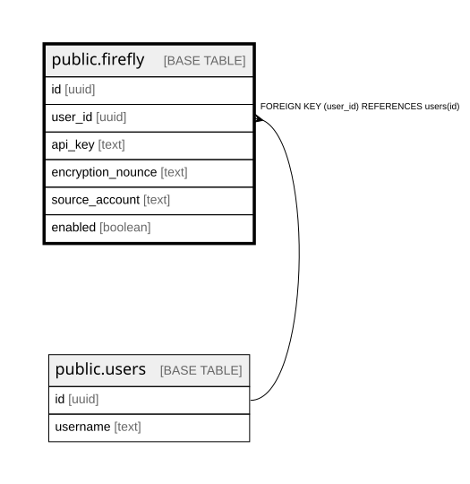

# public.firefly

## Description

## Columns

| Name | Type | Default | Nullable | Children | Parents | Comment |
| ---- | ---- | ------- | -------- | -------- | ------- | ------- |
| id | uuid |  | false |  |  |  |
| user_id | uuid |  | false |  | [public.users](public.users.md) |  |
| api_key | text |  | true |  |  |  |
| encryption_nounce | text |  | true |  |  |  |
| source_account | text |  | true |  |  |  |
| enabled | boolean | false | false |  |  |  |

## Constraints

| Name | Type | Definition |
| ---- | ---- | ---------- |
| firefly_enabled_not_null | n | NOT NULL enabled |
| firefly_id_not_null | n | NOT NULL id |
| firefly_user_id_not_null | n | NOT NULL user_id |
| firefly_user_id_fkey | FOREIGN KEY | FOREIGN KEY (user_id) REFERENCES users(id) |
| firefly_pkey | PRIMARY KEY | PRIMARY KEY (id) |

## Indexes

| Name | Definition |
| ---- | ---------- |
| firefly_pkey | CREATE UNIQUE INDEX firefly_pkey ON public.firefly USING btree (id) |

## Relations

---

> Generated by [tbls](https://github.com/k1LoW/tbls)
