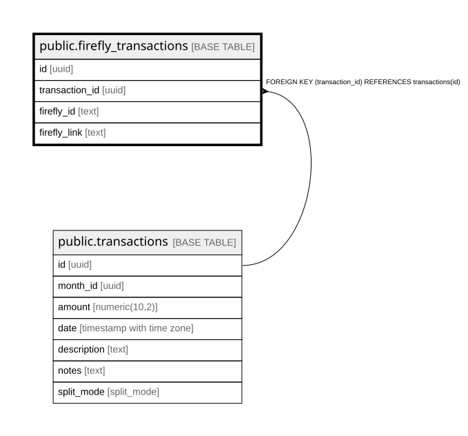

# public.firefly_transactions

## Description

## Columns

| Name | Type | Default | Nullable | Children | Parents | Comment |
| ---- | ---- | ------- | -------- | -------- | ------- | ------- |
| id | uuid |  | false |  |  |  |
| transaction_id | uuid |  | false |  | [public.transactions](public.transactions.md) |  |
| firefly_id | text |  | false |  |  |  |
| firefly_link | text |  | false |  |  |  |

## Constraints

| Name | Type | Definition |
| ---- | ---- | ---------- |
| firefly_transactions_firefly_id_not_null | n | NOT NULL firefly_id |
| firefly_transactions_firefly_link_not_null | n | NOT NULL firefly_link |
| firefly_transactions_id_not_null | n | NOT NULL id |
| firefly_transactions_transaction_id_not_null | n | NOT NULL transaction_id |
| firefly_transactions_transaction_id_fkey | FOREIGN KEY | FOREIGN KEY (transaction_id) REFERENCES transactions(id) |
| firefly_transactions_pkey | PRIMARY KEY | PRIMARY KEY (id) |

## Indexes

| Name | Definition |
| ---- | ---------- |
| firefly_transactions_pkey | CREATE UNIQUE INDEX firefly_transactions_pkey ON public.firefly_transactions USING btree (id) |

## Relations

---

> Generated by [tbls](https://github.com/k1LoW/tbls)
