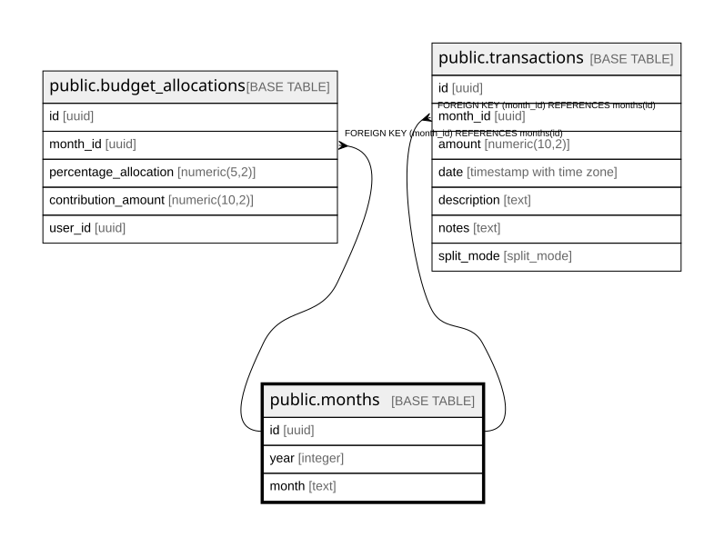

# public.months

## Description

## Columns

| Name | Type | Default | Nullable | Children | Parents | Comment |
| ---- | ---- | ------- | -------- | -------- | ------- | ------- |
| id | uuid |  | false | [public.budget_allocations](public.budget_allocations.md) [public.transactions](public.transactions.md) |  |  |
| year | integer | 2026 | false |  |  |  |
| month | text |  | false |  |  |  |

## Constraints

| Name | Type | Definition |
| ---- | ---- | ---------- |
| months_id_not_null | n | NOT NULL id |
| months_month_not_null | n | NOT NULL month |
| months_year_not_null | n | NOT NULL year |
| months_pkey | PRIMARY KEY | PRIMARY KEY (id) |
| unique_month_year | UNIQUE | UNIQUE (year, month) |

## Indexes

| Name | Definition |
| ---- | ---------- |
| months_pkey | CREATE UNIQUE INDEX months_pkey ON public.months USING btree (id) |
| unique_month_year | CREATE UNIQUE INDEX unique_month_year ON public.months USING btree (year, month) |

## Relations

---

> Generated by [tbls](https://github.com/k1LoW/tbls)
