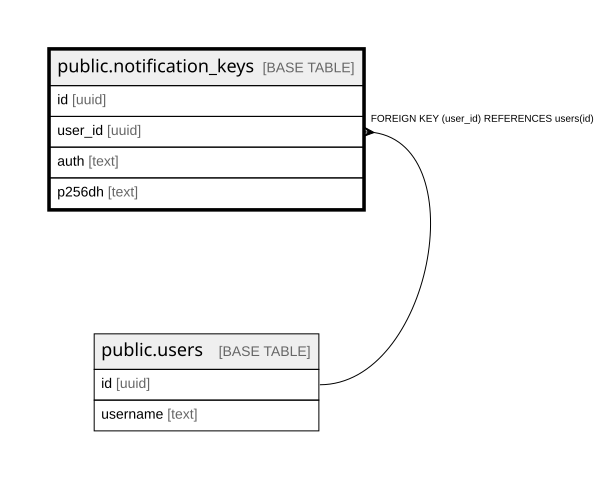

# public.notification_keys

## Description

## Columns

| Name | Type | Default | Nullable | Children | Parents | Comment |
| ---- | ---- | ------- | -------- | -------- | ------- | ------- |
| id | uuid |  | false |  |  |  |
| user_id | uuid |  | false |  | [public.users](public.users.md) |  |
| auth | text |  | true |  |  |  |
| p256dh | text |  | true |  |  |  |

## Constraints

| Name | Type | Definition |
| ---- | ---- | ---------- |
| notification_keys_id_not_null | n | NOT NULL id |
| notification_keys_user_id_not_null | n | NOT NULL user_id |
| notification_keys_user_id_fkey | FOREIGN KEY | FOREIGN KEY (user_id) REFERENCES users(id) |
| notification_keys_pkey | PRIMARY KEY | PRIMARY KEY (id) |

## Indexes

| Name | Definition |
| ---- | ---------- |
| notification_keys_pkey | CREATE UNIQUE INDEX notification_keys_pkey ON public.notification_keys USING btree (id) |

## Relations

---

> Generated by [tbls](https://github.com/k1LoW/tbls)
