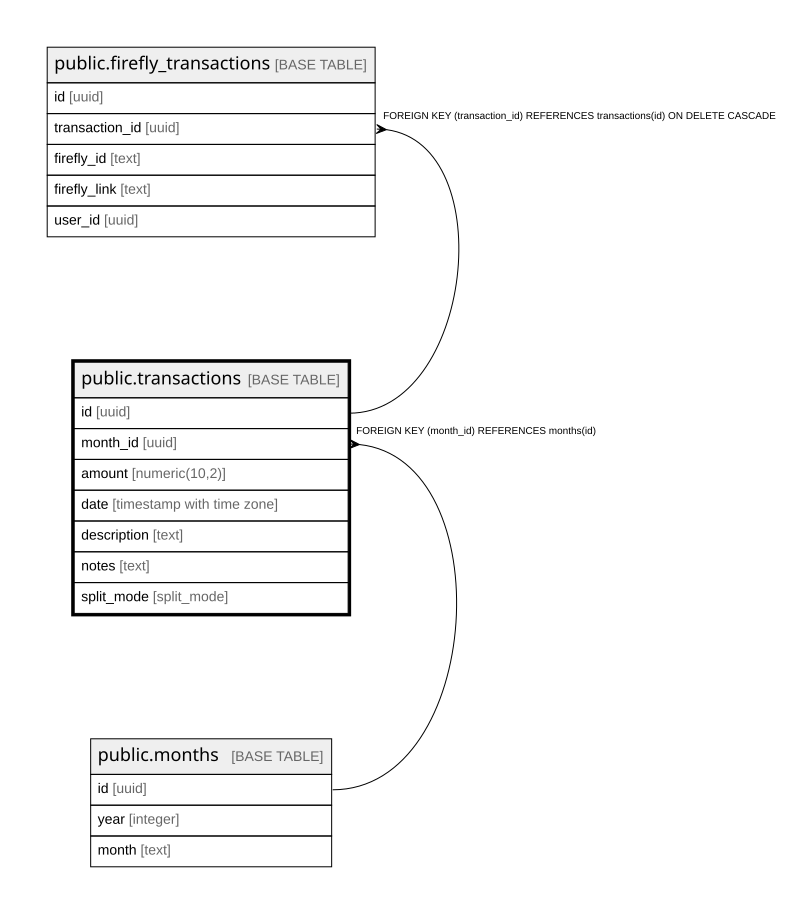

# public.transactions

## Columns

| Name | Type | Default | Nullable | Children | Parents | Comment |
| ---- | ---- | ------- | -------- | -------- | ------- | ------- |
| id | uuid |  | false | [public.firefly_transactions](public.firefly_transactions.md) |  |  |
| month_id | uuid |  | false |  | [public.months](public.months.md) |  |
| amount | numeric(10,2) |  | false |  |  |  |
| date | timestamp with time zone |  | false |  |  |  |
| description | text |  | true |  |  |  |
| notes | text |  | true |  |  |  |
| split_mode | split_mode |  | true |  |  |  |

## Constraints

| Name | Type | Definition |
| ---- | ---- | ---------- |
| transactions_amount_not_null | n | NOT NULL amount |
| transactions_date_not_null | n | NOT NULL date |
| transactions_id_not_null | n | NOT NULL id |
| transactions_month_id_not_null | n | NOT NULL month_id |
| transactions_month_id_fkey | FOREIGN KEY | FOREIGN KEY (month_id) REFERENCES months(id) |
| transactions_pkey | PRIMARY KEY | PRIMARY KEY (id) |

## Indexes

| Name | Definition |
| ---- | ---------- |
| transactions_pkey | CREATE UNIQUE INDEX transactions_pkey ON public.transactions USING btree (id) |

## Relations

---

> Generated by [tbls](https://github.com/k1LoW/tbls)
