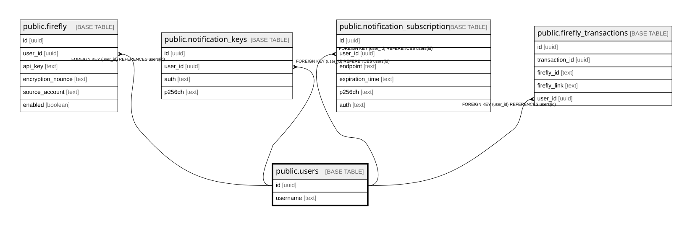

# public.users

## Description

## Columns

| Name | Type | Default | Nullable | Children | Parents | Comment |
| ---- | ---- | ------- | -------- | -------- | ------- | ------- |
| id | uuid |  | false | [public.firefly](public.firefly.md) [public.notification_keys](public.notification_keys.md) [public.notification_subscription](public.notification_subscription.md) [public.firefly_transactions](public.firefly_transactions.md) |  |  |
| username | text |  | false |  |  |  |

## Constraints

| Name | Type | Definition |
| ---- | ---- | ---------- |
| users_id_not_null | n | NOT NULL id |
| users_username_not_null | n | NOT NULL username |
| users_pkey | PRIMARY KEY | PRIMARY KEY (id) |

## Indexes

| Name | Definition |
| ---- | ---------- |
| users_pkey | CREATE UNIQUE INDEX users_pkey ON public.users USING btree (id) |

## Relations

---

> Generated by [tbls](https://github.com/k1LoW/tbls)
